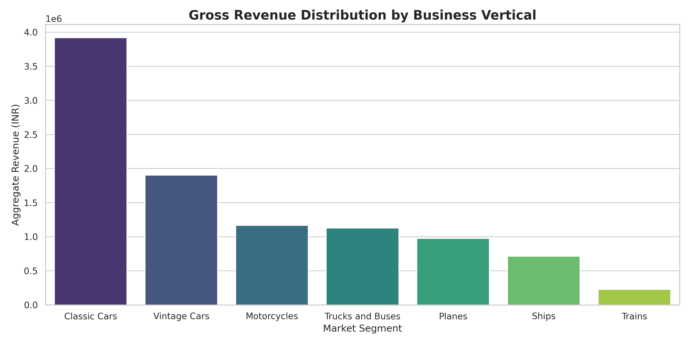

# Retail Revenue Audit and Customer Segment Analysis

## Project Overview
A comprehensive end-to-end data analysis of 2,800+ global transactions to identify high-value revenue drivers and optimize inventory strategy.

---

## Executive Summary
This project identifies the core product lines and regional markets that drive the highest profitability. By analyzing historical sales data, I developed a Python-based pipeline to clean, audit, and visualize business performance, providing a roadmap for revenue optimization.

### Key Business Insights
* Market Dominance: Classic Cars and Vintage Cars account for over 60% of total revenue, indicating a strong core market.
* Efficiency Metric: While 'Ships' has lower transaction volume, it maintains the highest Average Order Value (AOV), suggesting a high-margin niche.
* Regional Growth: North America remains the primary revenue driver, but the EMEA region shows significant untapped potential in the 'Medium' deal size category.

---

## Technical Stack
* Language: Python 3.10
* Libraries: 
    * Pandas (Data Wrangling and Profiling)
    * Seaborn and Matplotlib (Statistical Visualization)
    * NumPy (Numerical Operations)
* Environment: Jupyter Notebook / VS Code

---

## Data Pipeline and Methodology
I followed the professional ETL (Extract, Transform, Load) workflow to ensure data integrity:

1. Data Audit: Performed a high-level integrity check, identifying a 52% missingness in the 'State' column and addressing inconsistent formatting in 'Order Dates'.
2. Transformation: Standardized date-time objects, removed zero-value transactions, and handled null values in the Territory and Postal Code segments.
3. Exploratory Data Analysis (EDA): Aggregated sales by Product Line and Deal Size to calculate gross revenue distribution.
4. Reporting: Generated an executive-level visualization (executive_revenue_report.png) to present findings to non-technical stakeholders.

---

## Visual Insights

Figure 1: Gross Revenue Distribution by Product Line - Highlighting the dominance of the Classic Cars segment.

---

## Strategic Recommendations
Based on the data-driven evidence:
1. Inventory Focus: Increase stock levels for 'Classic Cars' by 15% to meet peak seasonal demand identified in Q4.
2. Targeted Marketing: Launch a retention campaign targeting 'Medium' deal size customers in the EMEA region to bridge the revenue gap.
3. Operational Efficiency: Review logistics for the 'Ships' category to capitalize on its high Average Order Value.

---

## Repository Structure
* Analysis_Notebook.ipynb: The complete Python source code and documentation.
* sales_data_sample.csv: The raw transactional dataset.
* executive_revenue_report.png: High-resolution export of the primary revenue chart.

---

## Author
Saran V
B.Tech in Artificial Intelligence and Data Science
